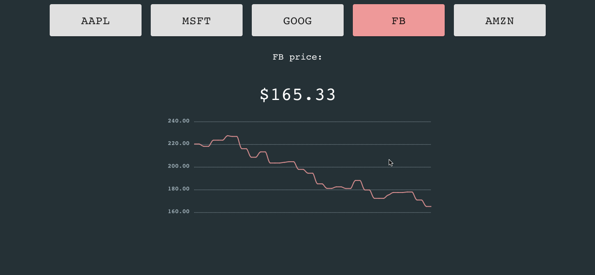

# simple-robinhood
## A simple ticker sim


### About:
This simulator updates 5 stock tickers every second in a mongoDB and displays those updates along with a graph history in a single-page react web app. 

### Tech stack:
**React**: js frontend library   
**Express**: node.js framework  
**Mongoose**: library for stock schema and mongoDB interaction  


### To start local simulation:
1. **Ensure you have [mongoDB](https://docs.mongodb.com/manual/administration/install-community/).**
    - Can start community edition with:
```
  brew services start mongodb-community@5.0
```
2. **Run in order(in start-scripts):**
```
        bash start-rh-server.sh
        bash start-SimDAQ.sh
        bash start-frontend.sh
```
3. **Navigate to http://localhost:3000/.** 

