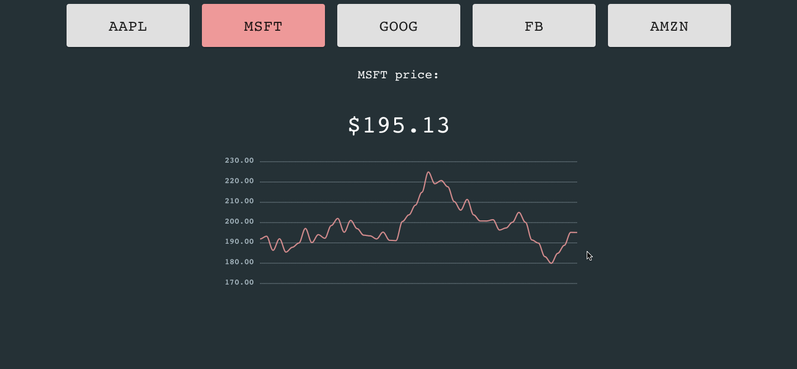

# simple-robinhood
## A simple ticker tracker

### To start simulation:
1. **Ensure you have started [mongoDB](https://docs.mongodb.com/manual/administration/install-community/).**
    - Can start community edition with:
```
  brew services start mongodb-community@5.0
```
2. **Open 3 terminal windows and run (in order):**
```
        bash start-SimDAQ.sh
        bash start-rh-server.sh
        bash start-frontend.sh
```
3. **Navigate to http://localhost:3000/ and *viola**.*
